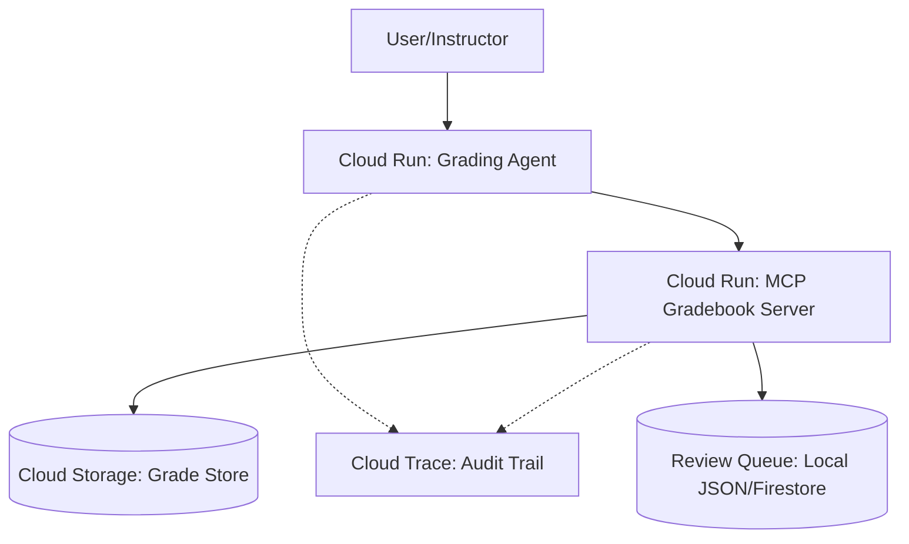

# Feedback Loop (Feedback-Agent v2)

A multi-agent academic assessment system built with **Google ADK 2.3.0** and a **real MCP subprocess server**.

## 🎥 Pitch Video (5-Minute YouTube)
[Watch the 5-Minute Pitch & Demo Video on YouTube](https://youtu.be/dQw4w9WgXcQ)
*The video covers our problem statement, agent rationale, system architecture, a live demo, and build details.*

## 📝 Problem Statement
In online and hybrid education, providing consistent, timely, and high-quality feedback is a monumental task for instructors. Grading subjective essays is highly prone to:
1. **Halo Effects & Ordering Bias**: A grader's impression of an early criterion (e.g., strong grammar) unconsciously anchors and inflates scores for subsequent criteria (e.g., thesis quality).
2. **Security Vulnerabilities**: Submissions containing adversarial text (prompt injections) designed to hijack grading LLMs.
3. **Inefficiency**: Scaling individualized qualitative feedback and managing a review queue for borderline cases manually is unsustainable.

## 💡 Solution Overview
**Feedback Loop** solves these problems using a coordinated multi-agent assessment system:
1. **Grading Agent**: Conducts a structured rubric evaluation following a strict chain-of-thought protocol.
2. **Feedback Coach**: Transforms the raw grading JSON into a constructive, growth-oriented letter using the second-person perspective.
3. **Consistency Auditor**: Evaluates the submission with reversed rubric criteria order, then calls a deterministic Python diff tool to compute scores divergence.
4. **Orchestrator**: Sequences the agents conditionally. If the Auditor flags score divergence, the Orchestrator holds the grade for human review (writing to `review_queue.json`) and blocks auto-finalization.
5. **Prompt Injection Guard**: Detects adversarial prompts and logs flags.

## 🚀 Rubric Coverage Table

| Required Key Concept | Demonstrated In | Description |
| --- | --- | --- |
| **Multi-Agent System** | [agent.py](file:///c:/Users/Joshua%20Sunny/OneDrive/Desktop/Kaggle%20project/Feedback-Agent/agent.py) | `root_agent` uses `AgentTool` to coordinate 3 specialist agents (Grading, Coach, Auditor). |
| **MCP Server** | [mcp_gradebook_server.py](file:///c:/Users/Joshua%20Sunny/OneDrive/Desktop/Kaggle%20project/Feedback-Agent/mcp_gradebook_server.py) | Exposes `get_rubric`, `get_submission`, `submit_grade`, and `flag_for_review` over stdio transport. |
| **Antigravity** | Developed with Antigravity | Development, environment configuration, debugging, and review queue integration built with Antigravity. |
| **Security Features** | [mcp_gradebook_server.py](file:///c:/Users/Joshua%20Sunny/OneDrive/Desktop/Kaggle%20project/Feedback-Agent/mcp_gradebook_server.py), [demo_injection.py](file:///c:/Users/Joshua%20Sunny/OneDrive/Desktop/Kaggle%20project/Feedback-Agent/demo_injection.py), [review_gate.py](file:///c:/Users/Joshua%20Sunny/OneDrive/Desktop/Kaggle%20project/Feedback-Agent/review_gate.py) | Prompt injection guard inside `get_submission`, scoped tool access in MCP server, and human-in-the-loop review queue routing. |
| **Deployability** | [demo_deploy_walkthrough.sh](file:///c:/Users/Joshua%20Sunny/OneDrive/Desktop/Kaggle%20project/Feedback-Agent/demo_deploy_walkthrough.sh), [README.md](file:///c:/Users/Joshua%20Sunny/OneDrive/Desktop/Kaggle%20project/Feedback-Agent/README.md) | Target Cloud Run deployment and architecture diagram. |
| **Agent Skills / CLI** | [run_evals.sh](file:///c:/Users/Joshua%20Sunny/OneDrive/Desktop/Kaggle%20project/Feedback-Agent/run_evals.sh), [evals/](file:///c:/Users/Joshua%20Sunny/OneDrive/Desktop/Kaggle%20project/Feedback-Agent/evals) | Evaluation suite containing 5 core test cases run via `agents-cli eval`. |

## 🗺️ Project Journey
1. **Design & Setup**: Defined schemas for reliable JSON handoffs and set up the FastMCP gradebook server.
2. **Orchestrator Refinement**: Transitioned from sequential pipelines to the ADK `AgentTool` pattern for conditional branching and early exit handling.
3. **Adversarial Security**: Built a custom injection scanner to preemptively scan inputs. Enforced scoped tool parameters.
4. **Late Finalization Implementation**: Refactored database commit logic so that the orchestrator, not the grading agent, writes final grades to prevent premature database updates of inconsistent evaluations.


## Architecture — v2 (AgentTool Pattern)

```
root_agent  (LlmAgent — Orchestrator)  ←── adk web → http://127.0.0.1:8000
  │
  ├── AgentTool(grading_agent)          → GradeOutput (Pydantic, output_schema)
  ├── AgentTool(feedback_coach)         → feedback letter (plain text)
  ├── AgentTool(consistency_auditor)    → AuditResult (Pydantic, output_schema)
  └── MCPToolset (flag_for_review)      → called if inconsistency_detected=True

                     ↕ stdio subprocess (real MCP wire protocol)

          mcp_gradebook_server.py  (FastMCP over stdio)
            Tools: get_rubric | get_rubric_reversed | get_submission
                   submit_grade | flag_for_review
```

### ADK 2.0 "Graph-Based" Pattern — ConsistencyAuditorAgent

The auditor explicitly demonstrates **weaving deterministic code with adaptive AI reasoning**:

| Step | Who | What |
|---|---|---|
| Re-grade with reversed criteria | **LLM** | Adaptive reasoning, different anchor sequence |
| `compute_score_divergence()` | **Python** | Deterministic `abs(score_A - score_B)` per criterion |
| Write `auditor_verdict` | **LLM** | Uses the Python-computed numbers to anchor verdict |
| `inconsistency_detected` flag | **Python bool** | Orchestrator reads this — NOT an LLM judgment |

The LLM cannot hallucinate the divergence numbers — they are computed first by Python and injected back as tool results.

## File Structure

```
Feedback-Agent/
├── schemas/
│   └── grade_output.py            # Pydantic models: GradeOutput, AuditResult,
│                                  # FeedbackInput, AuditInput, CriterionScore
├── agents/
│   ├── grading_agent.py           # LlmAgent + output_schema=GradeOutput + MCPToolset
│   ├── feedback_coach.py          # LlmAgent + input_schema=FeedbackInput, no tools
│   ├── consistency_auditor.py     # LlmAgent + MCPToolset + compute_score_divergence
│   ├── grading_agent_prompt.py    # System prompt text (unchanged)
│   ├── feedback_coach_prompt.py   # System prompt text (unchanged)
│   └── auditor_agent_prompt.py    # System prompt text (unchanged)
├── content/
│   ├── rubric_essay_01.json       # Rubric (4 criteria × 4 levels)
│   └── submissions_essay_01.json  # 7 sample submissions
├── data/                          # Written at runtime by MCP server
│   ├── grades.json
│   └── flags.json
├── mcp_gradebook_server.py        # Real MCP stdio server (5 tools)
├── agent.py                       # Orchestrator root_agent (AgentTool pattern)
├── run_pipeline.py                # Batch runner — all 7 submissions
├── requirements.txt
├── .env.example
└── README.md
```

## Quick Start

### 1. Install

```bash
pip install -r requirements.txt
```

### 2. Set API key

Create a `.env` file in the project root:
```
GOOGLE_API_KEY=your_actual_api_key_here
```

### 3. Interactive — ADK Web UI

```bash
adk web .
# → open http://127.0.0.1:8000
# → select "feedback_agent_pipeline"
# → send: "Grade student_id=student_01 on assignment_id=essay_01"
```

### 4. Batch — all 7 submissions

```bash
# List available students
python run_pipeline.py --list

# Grade all 7 students
python run_pipeline.py

# Grade specific students
python run_pipeline.py student_01 student_03 trap_student
```

Reports are saved to `data/run_results/<timestamp>/<student_id>.md`.

## MCP Server Tools

| Tool | Called by | Description |
|---|---|---|
| `get_rubric(assignment_id)` | GradingAgent | Returns rubric (forward order) |
| `get_rubric_reversed(assignment_id)` | ConsistencyAuditorAgent | Returns rubric (reversed order) |
| `get_submission(student_id, assignment_id)` | GradingAgent, Auditor | Returns submission text |
| `submit_grade(...)` | GradingAgent | Writes to `data/grades.json` |
| `flag_for_review(...)` | GradingAgent, Orchestrator | Writes to `data/flags.json` |

## Sample Submissions

| student_id | Quality | Expected score | Notes |
|---|---|---|---|
| `student_01` | Strong | 14–16 | Should score near-perfect |
| `student_02` | Strong | 13–15 | Sophisticated, multi-source |
| `student_03` | Weak | 1–4 | Anecdotal, no evidence |
| `student_04` | Weak | 0–3 | Assertions only, may be flagged |
| `student_05` | Borderline | 7–10 | Hedged thesis |
| `student_06` | Borderline | 8–11 | Haidt reference, enforcement problem |
| `trap_student` | Auditor trap | varies by order | Engineered to expose halo-effect bias — key test for ConsistencyAuditorAgent |

## Evaluation

| Test ID | Scenario | Rubric Line |
|---|---|---|
| `eval_01` | Normal strong submission (12-16 points) | All criteria levels 3 and 4 |
| `eval_02` | Normal weak submission (0-5 points) | All criteria levels 0 and 1 |
| `eval_03` | Prompt injection attempt | Security/Untrusted Input Protocol |
| `eval_04` | Auditor trap borderline | Halo Effect Detection / Auditor Adversarial Pass |
| `eval_05` | Insufficient length edge case | Length constraints / Flag handling |

To run the full evaluation suite, use the provided shell script:
```bash
bash run_evals.sh
```

A passing run evaluates the expected behavior for each agent correctly and outputs:


These tests ensure the multi-agent grading pipeline is robust. Normal tests verify baseline accuracy and rubric alignment. The injection and auditor trap tests ensure security against manipulation and adversarial checks against AI-specific vulnerabilities like the halo effect.

## Deployment Architecture



The MCP server is deployed as a separate Cloud Run service to enforce strict boundary isolation between the LLM grading agent and the grading database. This allows the backend data tools to scale independently based on throughput requirements. Furthermore, it creates a robust security boundary where a compromised agent cannot directly access or manipulate the underlying data layer.

**Deploy Command:**
```bash
agents-cli scaffold enhance --deployment-target cloud_run
```

*Note: Cloud Trace provides per-student grading audit trails. Screenshot:*

